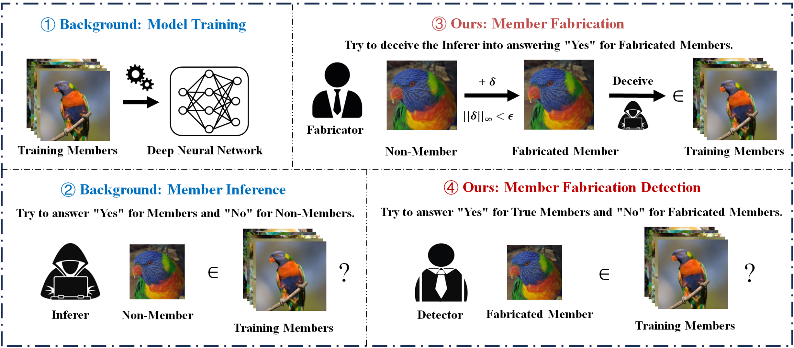
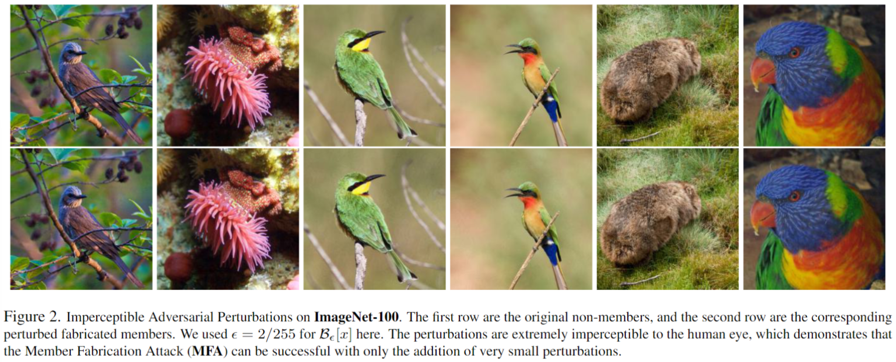

# Adversarial Membership Manipulation

This repository provides a **minimal and simplified reproduction** of the core ideas in our paper:

**A Unified Perspective on Adversarial Membership Manipulation in Vision Models**.

The paper is the **first to present a unified framework** for adversarial membership manipulation in vision models, including:

- **Member Fabrication Attack (MFA)**: fabricating membership through imperceptible input perturbations.
- **Member Fabrication Detection (MFD)**: distinguishing fabricated members from true members using **input gradient norm**.
- **Adversarially Robust MIAs (AR-MIAs)**: improving inference robustness by incorporating gradient-geometry signals into existing MIAs.

The methodology and design are already presented clearly in the paper. This codebase therefore provides a **simple working example** that reproduces the main pipeline in a lightweight way, so that follow-up researchers can easily understand the idea and extend it to their own settings.

## Overview

<p align="center">
  
</p>

The figure above summarizes the full framework: standard model training and membership inference in the background, followed by our two main problems of interest—**member fabrication** and **member fabrication detection**.

## Imperceptible fabricated members

<p align="center">
  
</p>

These examples illustrate the core intuition of MFA: very small perturbations can turn non-members into fabricated members while remaining visually almost indistinguishable from the originals.

## Repository structure

```text
.
├── assets/       # Figures used in this README
├── train/        # Train target and shadow models
├── fabricate/    # Generate fabricated members
├── gradient/     # Extract input gradient norms
└── evaluation/   # Export confidence statistics and evaluate detection
```

## 1. Train target and shadow models

**Script**
- `train/train_shadow_models_cifar10.py`

This script trains:
- one **target model**
- multiple **shadow models**

using CIFAR-10 and a ResNet-18 backbone.

Typical outputs:

```text
./target_model/
./shadow_models_A_new/
./shadow_models_B_new/
```

These models provide the basic setup for membership inference and follow the standard shadow-model pipeline used in prior MIA work.

## 2. Fabricate members

**Script**
- `fabricate/generate_fabricated_members_cifar10.py`

This script generates fabricated members under several attack variants, including FGSM, BIM, PGD, CW, adaptive PGD, and the stabilized adaptive PGD variant used in the experiments.

The key idea is to follow the MFA formulation in the paper: **increase confidence on the true label** rather than induce misclassification.

Typical outputs:

```text
./Max_adversarial_samples/
./loss_p/
```

## 3. Extract gradient norms

**Script**
- `gradient/extract_gradient_norm_cifar10.py`

This script extracts the **input gradient norm**

```text
||∇_x ℓ(f(x), y)||
```

which is the paper-consistent detection statistic used in **Member Fabrication Detection (MFD)**.

Typical output:

```text
./update_save_statistics/cifar10/original_train_1_input.npy
```

If you want to extend the pipeline, this is the first component to adapt to new datasets, new backbones, or new attack variants.

## 4. Evaluation

### 4.1 Export confidence statistics

**Script**
- `evaluation/export_shadow_confidences_cifar10.py`

This script exports confidence-based quantities from shadow models and the target model. These values are useful for building the broader MIA pipeline and for reproducing the supporting evaluation logic in the paper.

### 4.2 Plot detection ROC curves

**Script**
- `evaluation/plot_detection_roc_curves_gradient_norm.py`

This script plots ROC curves for distinguishing **true members** from **fabricated members** using the extracted **input gradient norms**.

### 4.3 Plot TNR–TPR attack comparison curves

**Script**
- `evaluation/plot_attack_roc_tnr_tpr.py`

This script compares attacks from the auditing perspective and reports summary statistics such as EER and 1-AUC.

### 4.4 Optional loss-based comparison example

**Script**
- `evaluation/plot_loss_roc_comparison_example.py`

This script keeps a compact loss-based ROC comparison example from the original code for reference.

## Minimal workflow

```text
1. Train target and shadow models
2. Generate fabricated members
3. Extract input gradient norms
4. Evaluate with ROC curves
```

## Important note

This repository is intentionally lightweight. It is meant to provide a **clear example implementation** of the framework.

We hope follow-up researchers can use this code as a starting point and extend the same idea to their own datasets, model architectures, and membership inference pipelines.

## Citation

If you find this repository helpful, please cite the paper.
